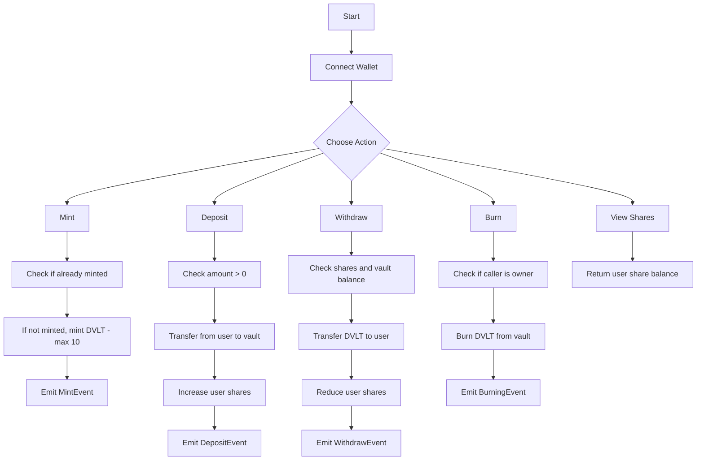

# 🔐 DeFi Vault on StarkNet

A decentralized financial vault built using Cairo and StarkNet. This vault lets users **deposit**, **withdraw**, **mint limited tokens**, and allows the owner to **burn** tokens, combining DeFi functionality with tokenized ownership via shares.

---

## 🧠 Features

* 🪙 **ERC20 Integration** with custom token (`DVLT`)
* 🧾 **Minting (Once-Only)**: Each user can mint up to **10 DVLT** just once.
* 📥 **Deposits**: Users deposit DVLT tokens to receive vault shares.
* 📤 **Withdrawals**: Users can withdraw tokens based on their shares.
* 🔥 **Burning**: Only the contract owner can burn DVLT tokens from the vault.
* 🔍 **Shares Tracking**: Anyone can query share balances per user.

---

## 🚀 Contract Details

* **Contract Address:** `0x02eafc50093e25fc8d3e14c45b8d4a6d8d21ba647db162cf335c78609b74d479`
* **Token Name:** Defi Vault (`DVLT`)
* **Network:** StarkNet (Cairo 1.0)

---

## 🛠 Functions Overview

| Function            | Description                                               |
| ------------------- | --------------------------------------------------------- |
| `minting(amount)`   | Mints `amount` of DVLT tokens to the caller once (max 10) |
| `deposit(amount)`   | Deposits DVLT and increases user shares                   |
| `withdraw(shares)`  | Withdraws DVLT based on shares                            |
| `burning(amount)`   | Burns `amount` of DVLT from vault (owner only)            |
| `shares(recipient)` | View shares of any user                                   |

---

## 🔄 Vault Flow



---

## ⚠️ Requirements

* StarkNet-compatible wallet (e.g. Argent X, Braavos)
* Some DVLT tokens (mintable once)
* StarkNet Sepolia testnet ETH for transactions

---

## 📦 Compilation & Deployment (Cairo 1.0)

```bash
# Compile
scarb build

# Deploy (if not already deployed)
starkli deploy --path target/dev/vault.sierra.json
```

---

## 📜 License

MIT License — use freely with attribution.

---

